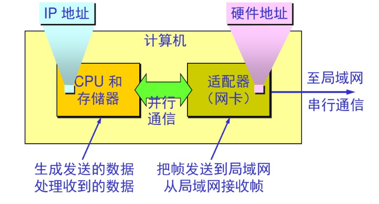

# 数据链路层
1. 作用
2. 信道类型
+ 点对点通道:使用一对一的点对点通信
+ 广播通道：一对多的广播通信方式 需要专用的信道协议来协调主机的数据发送
有个设计模式很像啊
3. 简单模型

4. 确定流程 逻辑上的实现 物理硬件上的实现
## 使用点对点信道的数据链路
1. 概念
+ 链路：一条无源的点到点的物理线路段  中间没有任何其他的交换结点
+ 数据链路：需要通信协议来控制数据的传输 把实现这些协议的硬件和软件加到链路上 构成数据链路
使用 适配器 网卡来实现这些协议的硬件和软件
一般的适配器 包括数据链路层和物理层
2. 传输流程

3. 三个问题
传递数据 数据中出现转移字符 类比富文本中出现了html脚本一样
1. 封装成帧
在数据的前后添加首部和尾部 构成一个帧  首部和尾部确认了帧的定界
用控制字符来进行帧定界
SOH + 数据部分 + EOH
SOH：帧开始符
EOH：帧结尾符
2.  透明传输
发送端在传输数据中出现了 控制字符 SOH或EOH 导致 解析的时候 错误的估算了帧开始符和帧结尾符  形成了错误的帧数据
解决方案：发送端的数据链路层 在 数据中出现 控制字符 SOH 和EOH前 提前前面插入一个转义字符 ESC （大小为1B）
如果传输数据出现了转义字符 就在前面再加一个
+ 字节填充/字符填充：接收端的数据链路层在传递给网络层之前删除插入的转义字符 如果有两个转义字符则 保留一个

3. 差错控制：传输的过程
+  比特差错：传输的数据 0 变成 1 1变成0
+  误码率：传输错误的比特占所输比特总数的比率的百分比  误码率与信噪比有很大关系

+  差错控制措施 保证数据的可靠性
+  循环冗余检验CRC技术
在发送端 将数据进行分组 每一组K个数据 在其数据后续加入 n位冗余码一起发送
+ 冗余码的计算(重点)
数据M
位数k
冗余码数n
除数P
余数R
商Q
+ 帧检验序列FCS：数据后面添加的冗余码 CRC并不是获取FCS的唯一方法(还有其他)
接收端对接收到的每一帧进行CRC判断 若得出余数R =0 则判定这个帧没错  部位0则判断这个帧有差异 丢弃
这个检测不能知道具体哪个比特出错 只能 进行整段式接收和丢弃  也就说无差错接受
0. 这里需要补习一下二进制的加减乘除
## 点对点协议PPP(point to point protocol)
1. ppp 协议满足的要求
+ 简单
+ 封装成帧
+ 透明性
+ 多种网络层协议
+ 多种类型链路
+ 差错检测
+ 检测连接状态
+ 最大传送单元
+ 网络层地址协商
+ 数据压缩协商

2. 不需要的功能
+ 纠错
+ 流量控制
+ 序号
+ 多点线路
+ 半双工或单工链路

3. ppp协议的组成
+ 一个将IP数据报封装到串行链路的方法
+ 链路控制协议LCP（link control protocol）
+ 网络控制协议NCP（network control protocol）

4. PPP协议的帧格式
+ 标志字段 F = 0x7E 看起来是开始和结尾
+ 地址字段 A= 0xFF 实际不起作用
+ 控制字段 C=0x03 
PPP是面向字节的 所有的ppp帧长度都是整数字节
**数据格式如下**
首部：F + A + C + 协议
信息部分: IP数据报Or ppp链路控制数据 Or 网络控制数据
尾部:FCS + F
信息部分的数据与 首部2个字节的协议字段有关
协议字段为0x0021时 IP数据报
         0xC021时 ppp链路控制数据
         0x8021时 网络控制数据

5. PPP协议对于透明传输问题的解决
+ PPP用于同步传输链路时 协议采用硬件来完成比特填充 与HDLC一致(HDLC是啥?)

+ PPP用于异步传输时 使用一种特殊的字符填充法
将信息字段出现的每一个0x7E(标志字符)  拆分为2字节序列(0x7D,0x5E)
若信息字段中出现一个0x7D字节 则转变为2字节序列(0x7D,0x5D)
若信息字段出现ASCII码的控制字符 数值小于0x20 则在该字符前面加入一个0x7D字节 同事将该字符的编码加以改变

+ 零比特填充
+ PPP协议在SONET(同步光纤网)/SDH链路时 使用同步传输(一连串的比特连续传送) PPP协议采用零比特填充的方法实现透明传输
+ 发送端 只要发现有连续5个1出现 就立即在其后填入一个0 接收端则对帧的数据流进行扫描 发现5个连续的1时就把后续给删除

+ 不使用序号和确认机制(这两者又是 前面有一个确认和重传的功能)的原因
数据链路层出错概率不大 比较easy的PPP协议比较合适
因特网网络环境下 PPP的信息字段放入的数据是IP数据报时 数据链路层的可靠信息并不能保证网络层的信息可靠
帧检验序列FCS能保证无差错的接收

6. ppp协议的工作状态
1. 用户接入ISP时 路由器的调制解调器对拨号做出确认 建立一条物理链路(物理层搭建完成)
2. PC机向路由器发送一系列LCP分组(包含多个PPP帧) // 通过建立的物理链路
3. 这些分组响应选择一部分PPP参数 和？？？进行网络配置 NCP给PC机分配一个IP地址 PC机成为主机(联网) 
4. 通信完毕后 NCP释放网络层连接 收回IP地址 LCP收回数据链路连接  最后释放物理层连接

网络链路层被分为了LCP和NCP两个子层LCP负责对接物理层吗 NCP则是对接网络层？

## 使用广播信道的数据链路层
### 局域网的的数据链路层
1. 局域网的特点
2. 局域网的优点
3. 媒体共享技术
+ 静态划分信道
频分复用
时分复用
波分复用
码分复用
+ 动态媒体接入控制
随机接入
受控接入
5. 数据链路层子层
### 适配器的作用
**概念** 网络接口板 通信适配器 网络接口卡 网卡
**功能**
+ 进行串行/并行转换
+ 对数据进行缓存
+ 在计算机的操作系统安装装备驱动
+ 实现以太网协议

cpu和存储器负责生成传输数据和解析接收数据 与网卡并行通行 (IP地址位于这里 但前面有提过 IP地址是通过NCP分配的 也就是路由器)
网卡则把则负责给局域网发送帧和接收帧信息(硬件地址位于这里 MAC地址)
###  以太网
**概念** 以太网是符合 DIX Ethernet V2标准的局域网 IEEE 802.3局域网也简称以太网
1. 局域网的数据链路层拆分为 逻辑链路控制LLC(logical link control) 媒体接入控制(media access control)
与接入到媒体相关的都放到MAC子层 LLC子层则与媒体无关 何种协议对LLC是透明的 
然而一般不考虑LLC了 很多厂商的适配器也没有LLC

## 使用广播信道的以太网
0. 早期的以太网选择是靠总线广播的设计模式来设定的 所有的计算机连接到一根总线上
+ 例子：当B向D发送数据的时候 每一个数据都检测到B发送了数据 但只有D的地址与数据首部帧写入的一致 才能接收  其他接收不了丢弃 就实现了一对一通信
1. 以太网做的措施
+ 采用灵活的无连接的工作方式 即不必建立连接就可以发送数据
+ 以太网对发出的数据帧不进行编号 也不要求对方发回确认
因为局域网信号好 信道质量产生差错的概率低

2. 以太网提供的服务
+ 以太网提供的是不可靠交付 最大努力的交付 至于你收没收到不管
+ 目的站收到错误的帧直接丢弃 什么都不做 交给高层处理
+ 高层发现丢失了一些数据帧而进行重传 但以太网是不知道这是重转 会当成新的帧传送
+ 以太网发送数据通过曼切斯特编码传输
以太网无情的发帧工具  高层控制 目的站 无情接收工具

### 载波监听多点接入/碰撞检测 CSMA/CD
1. 概念
+ 多点接入：计算机以多点接入的方式连接到一条总线上
+ 载波监听： 每一个站在发送数据之前先要检测一下总线上是否有其他的计算机发送数据 如果有就停下来 避免发生碰撞
总线是没有载波的 监听的实现是依靠 电子技术检测总线上有没有其余计算机发送的数据信号
+ 碰撞检测：计算机一边发送数据 一边检测检测信道上的信号电压大小 
当几个站同时在总线上发送数据的时候 信号电压摆动值将会增大(互相叠加)
当一个站检测到的信号电压值达到某个门限值的时候  就认为总线上有超过一个站发送了数据 表明发生了碰撞
碰撞的结果是两个帧都变得无效
+ 广播总线与各个站

+ 重要特性
+ 使用CSMA/CD协议 的以太网 不能双工通信 只能进行双向交替通信(半双工通信)
+ 每个站在发送数据的一小段时间后都有可能遭受到碰撞的可能性
+ 发送不确定性使整个以太网的平均通信量远小于以太网的最高数据率
### 碰撞处理流程
0. 检测到碰撞后 
+ 总线上的传输的信号会得到严重失真 无法从中恢复出有用的信息来
+ 每一个正在发送数据的站 在发现总线出现碰撞后 就会立即停止发送 免得浪费资源 过了随机时间后再发送
1. 电磁波的影响
某个站当时监听到总线空闲 其实也不一定空闲 因为A会向B发出信息 需要一段时间才能传送到B
B这个时候毫无感应 B如果在信息收到前 也向A发送数据 那必然会在中间一个时间段碰撞

2. 传播时延的影响
+ 争用期 以太网 端到端往返时延2T(周期) 经过争用期//碰撞窗口 才能确认 是否发生了碰撞

+ 争用期长度: 规定51.2us为争用期

+ 二进制指数类型退避算法

+ 最短有效帧长 凡是帧数长度小于64字节的帧

+ 强化碰撞
一旦发现发生了碰撞就会立即停止发送数据
再继续发送若干比特的人为干扰信号 让所有人都知道已经产生了冲突

## 扩展的以太网
### 硬件层
+ 集线器 大规模使用集成电路芯片 硬件设备可靠性大大提高
**特点**
使用电子器件模拟实际电缆线的工作 整个系统仍然像传统以太网那样工作
使用集线器的以太网在逻辑上仍然是一个总线网  各工作站仍然使用的是CSMA/CD协议 并共享逻辑总线 // 还是总线 意味着仍然有冲突发生
集线器像一个多接口的转发器 在物理层上提供
// 从图上看 双绞线和集线器内部的电路器件一起完成了站与站数据之间的通信

+ 双绞线
1. 使用集线器的无屏蔽双绞线代替原来的电缆 组成 星型拓扑星型以太网 每个站需要两对双绞线 便于发送和接收 无屏蔽双绞线提供了设备的可靠性 降低了成本
### 以太网的信道利用率
+ Tau：传送时延
+ L：帧长(bit)
+ C0:数据发送速率(b/s)
+ T0 = L/C0 :帧发送时间 
+ 发送一帧的平均时间： 发生碰撞时期 + 占用期 = n个争用期 + 发送数据事件 + 信道转为空闲期 = nTau + T0 + Tau

想提高信道利用率就需要减少 Tau与To的比例
+ a:以太网单程端到端的时延与Tau 与 与帧发送时间 To之比 a = Tau/To
a->0表明一发生碰撞就能检验出来 并立即停止发送 因此信道利用率很高
a越大说明争用期 占用比例越大 每发生一次碰撞所消耗的资源就越多 信道利用率就越低
+ 以太网参数限制： 数据率一定时 以太网的连线长度会受到限制 否则Tau太大 以太网的帧长To不能太小 会导致a变大
+ Smax：信道利用率的最大值
理想化情况下： 无争用期时间  因此 发送一帧占用线路的时间是 Tau + To 帧本身发送时间是T0
Smax = To/(Tau + To) = 1/1 + a  证明 a越大 信道利用率极限值越小

### 以太网的MAC地址
1. MAC地址
2. 适配器检查MAC地址
适配器从网络上每收到一个MAC帧就首先使用硬件检查MAC地址 先用硬件检查MAC帧中的MAC地址
如果是针对本站的帧就接受 不是则丢弃

3. MAC帧的格式
4. 无效的MAC帧
5. 最小间隔帧

## 如何扩展局域网
### 硬件层 
+ 集线器
+ 光纤
+ 光纤调制解调器
+ 网桥
+ 透明网桥
+ 源路由网桥
+ 多接口网桥--路由交换机
### 物理层上扩展局域网
1. 使用集线器扩大局域网
使用光纤和一对光纤调制解调器连接到集线器
集线器与集线器相连形成更大的局域网
+ 优点：原来属于不同碰撞域的局域网上的计算机能够进行跨域碰撞的通信 并且扩大了局域网覆盖的地理范围
+ 缺点：碰撞域增大 但是吞吐量没有变化 不同的碰撞域如果使用不同的数据率 就无法使用集线器

2. 在数据链路层上扩大局域网
 使用各类网桥来扩展数据链路层上的局域网
 网桥在数据链路层上工作 根据MAC帧的目的地址对收到的帧进行转发
 网桥具有过滤帧的作用 当收到帧的时候会先做对该帧的目的MAC地址 然后进行转发
+ 优点： 
过滤通信量 
扩大了物理范围 
提高了可靠性 
可互连不同物理层 不同MAC子层和不同速率的局域网
网桥可使各网段成为隔壁开的碰撞域
+ 缺点
存储转发增加了延时
在MAC子层没有流量控制功能
不同MAC子层相连时产生的延时更大
网桥只适合用户量不太多和通信量不太大的局域网 否则会因为传播过多的广播信息发生网络堵塞 就是所谓的广播风暴

3. 集线器与网桥的区别
集线器转发帧的时候是不会对媒体做进行检测的
网桥在转发帧之前必须做检测过CSMA/CD算法 在发送过程中发生碰撞 就必须停止发送和进行退避
+ 网桥的内部结构

+ 网桥的传输过程

### 透明网桥（重点）

### 源路由网桥

### 多接口网桥
## 高速以太网
+ 高速以太网
+ 快速以太网
### 吉比特以太网

### 
## 其他类型的告诉局域网接口

## 额外问题
1. 数据链路层的物理实现和物理载体
2. 数据链路层的逻辑协议
3. 数据链路层实际在网络传输做的流程和事情 并且使用的载体

let arr = [{name:1, id:1}, {name:1,id:2}, {name: 2,id:3}, {name :4, id:4},{name:2,id:5}]
let obj = {}
let newArr = []
arr.forEach((item)=>{
    if(!(item.name in obj)){
        obj[item.name] = item.id
        newArr.push(item)
    }
})
console.log(newArr,obj)