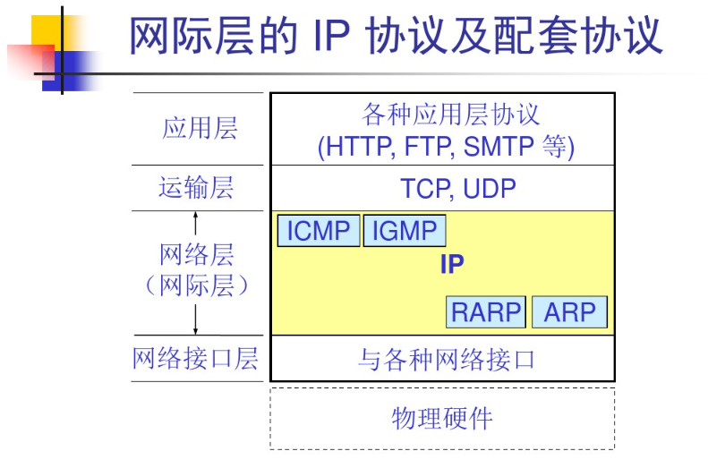
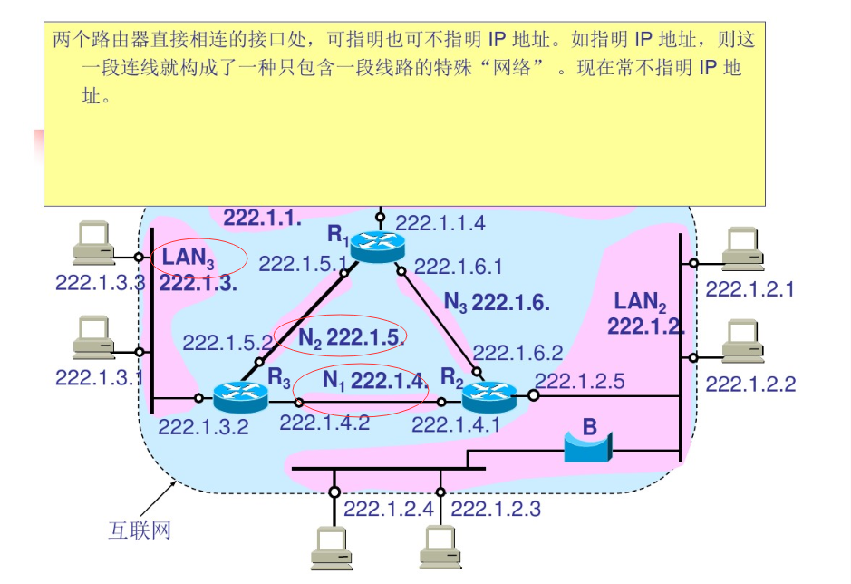
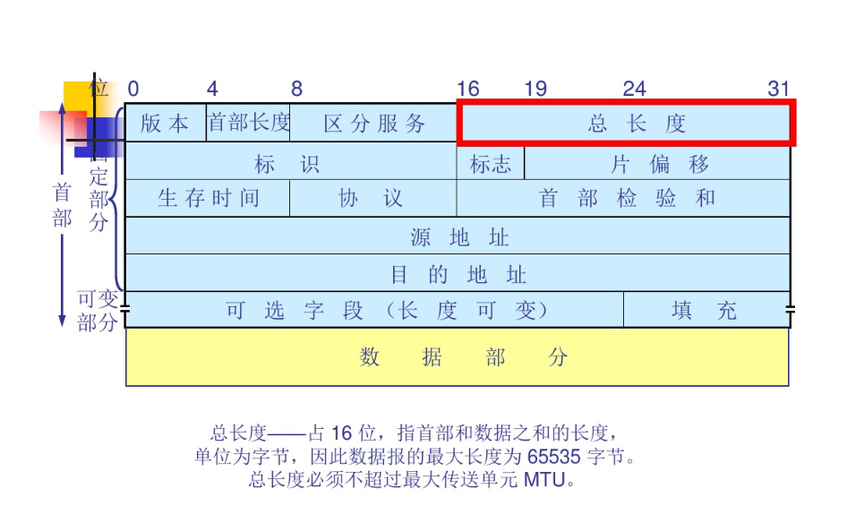
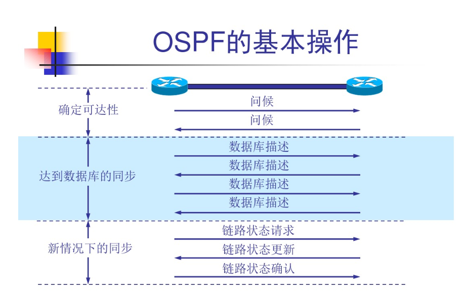
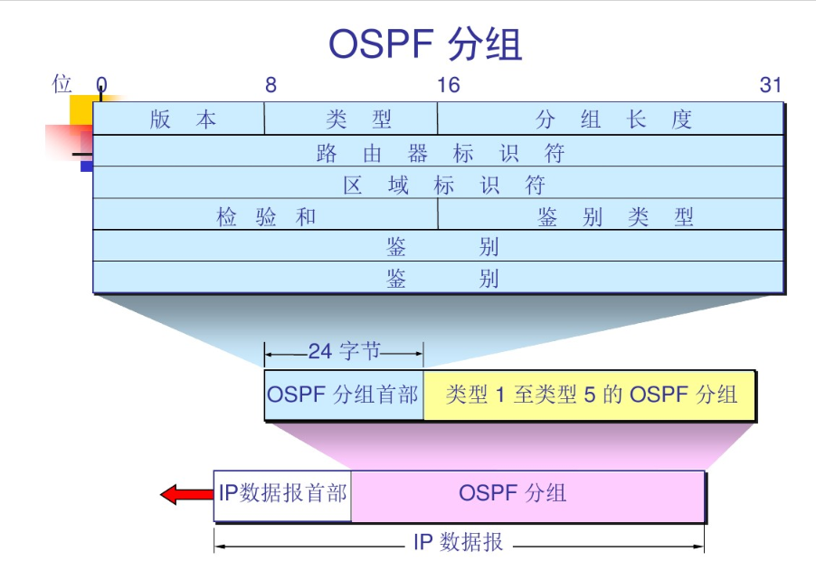

# 网络层
## 涉及到的硬件
## 涉及到的软件
## 实现的目的 各个部分产生的作用
## 开篇的重点
+ 虚拟互联网络的概念
+ IP地址与物理地址的关系
+ 传统的分类的IP地址(包括字码掩网) 和 无分类域间选择器选择 CIDR
+ 路由选择协议的工作原理

## 网络层提供的服务
网络层应该给运输层什么样的服务
面向连接 还是 无连接
可靠交付
### 网络设计思路
1. 网络层只是尽力的交付数据 只传不更改
+ 网络层向上只提供简单灵活的 无连接 尽最大努力交付的数据报服务+ 
+ 网络在发送分组时不需要建立连接 每一个分组独立发送  与其前后分组无关
+ 网络层不提供服务质量的承诺 所传递数据可能出错 丢失 重复 也不保证分组传送的时限  只负责传送
2. 尽力交付好处
+ 传输网络不提供端到端的可靠传输服务 使网络中的路由器可以做的简单 与电信网的交换机相比 价格低廉
+ 如果主机中的进程间的通信需要是可靠的 由网络的主机中的运输层负责
3. 设计思路优点 网络造价大大降低 运行方式灵活 能适应多种应用
### 虚电路服务
+ 面向连接的通信方式
+ 建立虚电路 保证双方通信所需的一切资源
+ 如果再使用可靠传输的协议 就可以使所发送的分组无差错的按序到达终点
+ 虚电路是虚拟的逻辑连接 分组沿着这条逻辑连接按照存储转发方式传送 并不是真实的物理连接
+ 分组交换的虚连接与电路连接不同 只是类似 电路连接是真正的建立了一条线

+ 虚电路服务与数据报服务的区别
### 数据报服务

## 网际IP协议
TCP/IP体系中 两个最重要的协议之一
与ip协议配套使用的还有四个协议
+ 地址解析协议 ARP Ip地址经过 ABR转换后 得到物理地址
+ 逆地址解析协议RARP 物理地址经过 RARP转换后 得到IP地址
+ 网际控制报文协议 ICMP
+ 网际管理协议 IGMP


## 虚拟互连网络
0. 涉及到问题 
+ 不同的寻址方案
+ 不同的最大分组长度
+ 不同的网络接入机制
+ 不同的超时控制
+ 不同的差错恢复方法
+ 不同的状态报告方法
+ 不同的路由选择技术
+ 不同的用户接入控制
+ 不同的服务
+ 不同的管理与控制方式
如何解决？

1. 网络互连涉及的物理设备
中间设备/中间系统/中继设备(relay 依赖？)
+ 物理层中继系统：转发器(repeater)
+ 物理链路层中继系统：网桥或桥接器(bridge)
+ 网络层中继系统：路由器(router)
+ 网桥和路由器的混合物“桥路器(broute)
+ 网络层以上的中继系统：网关(gateway)

2. 使用各种中继系统的区别
+ 当中继系统是转发器或网桥时 只是扩大了网络范围 并不是一个互连网络
+ 网关比较复杂 目前使用较少
+ 互联网是指用路由器进行互连的网络
+ 由于历史原因 tcp/ip文献将网络层使用的路由器叫网关

3. 意义
+ 使用逻辑互连网络可以使得各个物理网络的异构性在利用IP协议时看起来像个统一个网络
+ 使用IP协议的虚拟互连网络简称为IP网
+ 使用虚拟互连网络的好处：当互联网主机进行通信时 就像一个网络上通信 但看不见互连的各个具体的网络异构细节

### 分类的IP地址
1. Ip地址的表示方法
+ IP地址给每个连接在互联网上的主机或路由器分配一个全世界范围是唯一的 32 位的标识符
+ IP地址现在由ICANN分配 // 因特网名字与号码指派公司

2. IP地址的编址方法
+ 分类的IP地址
+ 子网的划分
+ 构成超网

3. 分类IP地址
+ 每一类地址都由两个固定长度的字段组成 其中一个字段是
网络号:net-id 标志主机/路由器连接到的网络
主机号：host-id 标志主机或路由器
ip地址::={<网络号>,<主机号>}  ::= 代表定义为
+ Ip地址中的网络号字段和主机号
A类地址：0 8位 net-id + 24位 host-id
B类地址：10 net-id(16位)
C类地址：110 net-id(24位)
D类地址: 1110 + 多播地址
E类地址：1111 + 保留为今后使用
8位一个字节？
ABCDE决定了IP的地址划分

B类 
C类 192.x.x.x
+ 点分十进制记法
机器中存放IP地址32位
每隔8位插入一个空格
再每8位二进制转为十进制
形成了最后的IP
128.11.3.31

4. IP地址的重要特点
+ IP地址是一种分等级的地址结构 分两个等级的好处
IP地址管理机构分配IP地址时只分配网络号 其他的由该网络自行分配 方便管理
路由器仅根据目的主机所连接的网络号进行转发分组 这样使得路由表中的项目数大幅度减少
从而减少路由表所占的存储空间
+ 实际上IP地址是标志一个主机与一条链路的接口

+ 用转发器或网桥连接起来的若干个局域网仍然为一个网络 这些局域网有着同样的网络号 net-id
192.168.2.xxxx 前面的net-id一致 说明是同一个网络

+ 所有分配到网络号 net-id的网络 范围无论大小的 都是平等的 无论是局域网还是广域网

+ 路由器总是具有两个或两个以上的IP地址 路由器的每一个接口都有不同的IP地址
路由器有多个IP与不同的路由器连接一起 主机通过路由器与不同net-id的网络相连在了一起


5. ip地址与硬件地址
网络层以上使用IP地址 
链路层以下使用硬件地址

6. 地址解析协议ABR和逆地址解析协议RABR
+ 无论网络层使用什么协议 在链路层上传输数据帧的时候 最终还是必须使用硬件地址
+ 每一个主机都拥有一个ARP高速缓存 里面有所在 局域网  上的各主机和路由器的IP地址到硬件地址的映射表
+ 当主机A想向主机B发送IP数据时 会先去ARPCache里查找有无对应的IP地址 再找到对应的硬件地址 封装到MAC帧上 局域网把该MAC帧发送到B的硬件地址
总的来说 ARP存了所有局域网内所有主机的地址 每次使用前都可以去查 查到就能顺利TP
+ 为了减少网络通讯量 主机A发送ARP请求分组时 就将自己的IP地址到硬件地址的映射写入ARP请求分组 B接收的时候把A的映射地址存入自己的ABR缓存中 下次通讯就快很多
类似于发送快递的时候 顺带了自己的地址 这样返回来就快的多了

7. ARP需要注意的问题
+ ARP解决的是同一个局域网的主机或者路由器的硬件地址与IP地址映射 如果不在一个局域网 就找到路由器的地址 转发给路由器 由路由器去转发给另一个网络
+ IP地址与硬件地址的解析是自动的 主机用户是不知道这个过程的 只要主机和已知网络的任意一个IP进行通信 ARP协议就会自动把IP地址解析为链路层需要的硬件地址
+ 因为IP地址统一且通信方便 硬件地址因为各式各样的格式不统一 所以不会选择硬件格式直接通信
+ 四种情形  主机给路由器 路由器给路由器 路由器给主机  主机给主机

8. IP数据报的格式
由首部和数据两部分组成
首部 20个字节固定字段 + 长度可变的额外字段
数据
// 许多构成和名词等待记录


9. IP层转发分组的流程
+ 按主机所在的网络地址来制作路由表比按目的主机号制作要节约空间的多 对4个A类网络 3个路由器来说 每个路由表只需要4个项目
在路由表中 最重要的是下一跳的地址 也就是路由器间相互交换沟通的地方 经过一次次的间接交付 到达最后一个路由器才交付给主机
(类似快递) 经历一个个快递点转发 

+ IP数据报的首部中没有地方可以用来指明 下一跳路由器的IP地址
+ 当路由器收到待转发的数据报时 不是将下一跳路由器的IP地址填入IP数据报 而是送交给下层的网络接口软件
+ 网络接口软件负责使用ARP将下一跳路由器地址转为硬件地址  并将此硬件地址 放在链路层的MAC帧的首部
然后根据这个硬件地址找到下一跳路由器

+ 路由种类

10. 分组转发算法
1. 从数据报首部提取目的主机的IP地址D  得出的网络地址为N
2. 若网络N与此路由器直接相连 则把数据报直接交付目的主机D 否则间接交付交付 执行3
3. 路由表中有目的地址为D的特定主机路由 则把数据报传送给路由表中所指明的下一跳路由器  否则执行4
4. 若路由表中有达到网络N的路由 则把数据传递给路由表指明的下一跳路由器 否则执行5
5. 若路由表中有一个默认路由 则把数据报传送给路由表中所指明的默认路由器 否则执行6
6. 报告转发出错

从三条路线分别 按IP地址 网络地址 默认路由开始查找 如果都没 那就有问题
这里画个 if else比较好 

## 划分网络子网和构造超网
1. 二级IP划分的缺陷
+ 
2. 三级IP划分 子网划分 划分子网基本思路

+ 划分子网属于内部的事  对于外部仍然是一个整体未划分的网络
+ 从主机号借用若干位作为 子网号  subnet-id 主机号对应减少部分 ip地址变更为 ip  :: = {<网络号net-id>,<子网号 subnet-id>, <主机号 host-id>}
+ 从其他地方发送来的IP数据报 先查看net-id找到对应路由器 再按照net-id和subnet-id缩小范围交付到目的主机
(快递网点再次细分)
+ 划分子网之后是三级IP 没划分是二级 并且划分后占用的是主机host-id net-id未变
+ 划分过后IP地址分配的网络地址将发生变化 与之前没划分前的区别在哪里？

3. 子网掩码(因为不知道对面到底划分子网没有 所以添加一个参数来识别) 使用子网掩码可以找出IP地址中子网部分
+ 路由器现在和相邻路由器交换路由信息时必须把自己网络的子网掩码也告诉相邻路由器
+ 路由表现在不止要给出每一个路由项目的路由信息也要给予对应网络的子网掩码
+ 路由器连几个网络就有几个子网掩码
+ 不同的子网掩码得出相同的网络地址 但是起到的作用不同  (划分的网络端数量不同/主机位置数量)
比如
255.255.192.0 ---- 11111111.11111111.11000000.00000000  网端号2的14次方-2个
255.255.224.0 ---- 11111111.11111111.11100000.00000000  2的13次方-2个位置

4. 使用子网掩码后的转发
只是在第一步多了一步根据子网掩码转化为网络地址 其他依旧是正常的交付 查路由器 查默认路由 在没有子网划分的时候 IP地址与网络地址是一一对应的 即前面的netID部位
1. 根据目的网络的IP地址与掩码计算网络地址 是否与发起地A1在同一个网端 在就可以直接交付了

2. 不在一个网端则交给路由器 路由器去路由表中寻找对应的网端 找到子网就可以转发过去交互

3. 这个路由器的路由表里没有 那就丢给下一个路由器的路由表 看看其他路由表有没有目的地址的网端 有就跳转过去

4. 还没找到就丢到默认路由

5. 默认路由都没有 那就出问题了

// 
1. 拿到快递单先计算在那个村 是不是同一个村 如果是就直接同村快递
2. 如果不是同村快递 就查查是不是隔壁村或者其他村的 是就交付给其他村的菜鸟驿站
3. 如果相近的村就没有 就查查对应的城市网点看有没有离快递单近的扔过去
4. 如果城市各个网点都找不到目标 菜鸟驿站点 那就送到默认的丰巢邮柜
5. 如果没有默认的存放地  那肯定是快递填错了

### 无分类编址CIDR
0. CIDR地址块
+ 掩码
+ CIRD地址块与分配
1. 最长前缀匹配
2. 二叉线索匹配


## ICMP网络控制报文协议
0. 概念
+ ICPM不是高层协议 是IP层的协议
+ ICMP报文作为IP层数据报的数据 加上数据报首部 组成IP数据报一次发送出去
1. 功能
+ 为了提高IP数据报的交付成功的机会
+ ICMP允许主机或路由器报告差错情况和提供有关异常情况的报告
2. 种类 ICMP前三个字节是 类型 代码 校检和 第四个字节往后与类型关联
+ ICMP询问报文
回送请求与回答报文
时间戳请求和回答报文
废弃的报文
信息请求与回答报文
掩码地址请求和回答报文
路由器询问和通告报文
+ ICMP差错报告报文
终点不可达
源点抑制
时间超过
参数问题
改变路由(重定向)

+ 当以下情形发生时不再发送ICMP差错报告报文
对ICMP差错报文
对第一个分片的数据报片后续的所有数据报片
对具有多播地址的数据报
对具有特殊地址的 127.0.0.0和 0.0.0.0
3. 使用
+ ping与tracert 是应用层直接使用网络层的协议 没有经过运输层 使用了ICMP回送请求和回送回答报文 //ICMP的询问报文


## 因特网的路由选择协议
0. 为什么要进行路由选择？

1. 理想的路由算法
+ 算法正确完整且简单
+ 算法稳定最佳且公平
+ 算法自适应性要强 能适应通信量和网络拓扑变化

2. 最佳路由
+ 网络中所有结点共同协调工作的结果
+ 路由选择的环境往往是不断变化的 这种变化有时无法事先知道

3. 路由算法自适应考虑
+ 静态路由选择策略：非自适应路由选择
特点 开销小和简单 但不能及时适应网络状态的变化
+ 动态路由选择策略：自适应路由选择
特点 较好适应网络状态的变化 实现起来复杂 开销也大

3. 路由选择协议
因特网采用分层次的路由选择协议（分哪些？）

4. 自洽系统 AS（autonomous system）
单一的技术管理下的一组路由器 
路由器使用AS内部的路由选择协议和共同的度量以确定 分组 在AS内的路由
同时使用AS之间的路由选择协议确定 分组 在 AS之间的路由

AS对其他AS表现出一个单一的和一致的路由选择策略

// 简单说内部跑一种协议 外部跑一种协议 但是在外部的协议一定是一致的路由选择 方便两者交互
5. 内部网关协议
IGP：在AS内部使用的路由选择协议 如RIP OSPF
interior gateway protocol
域内路由选择 interdomain routing
6. 外部网关协议
EGP：源站和目的站处于不同的自洽系统时 AS与AS之间的路由选择信息传递使用的协议 BGP4
域内路由选择 intradomain routing
external gateway protocol
### RIP协议
1. 工作原理
+ 最先广泛使用的协议
+ 分布式的基于 距离向量 的路由选择协议
+ 要求网络中每一个路由器都要维护 它自己 到 其他每一个 目的网络的距离记录

2. 距离定义
+ 路由器与直连网络距离定义为 1 路由器离下一个路由器距离 为经过的路由器个数 也叫跳数
+ 距离指的是最短距离 允许一条路径最多只能包含15个路由器 最大值为16 等于不可到达
+ RIP不能在两个网络间使用多条路由 只有选距离最短的路由 哪怕距离长的那一条高速且低时延

3. 协议要点
+ 仅和相邻路由器交换信息
+ 交换的信息是当前路由器所知的全部信息 既自己的路由表 
+ 按固定的时间间隔交换路由信息

4. 路由表建立
+ 路由表刚工作时 只知道直接连接的网络的距离  距离定义为1
+ 之后 每个路由器只和数目非常有限的 相邻路由器交换 并更新路由信息
+ 若干次更新后 所有路由器最终都知道到达AS中 任何一个网络的最短距离 和 下一跳路由器的地址
+ RIP协议的收敛过程较快 在AS中所有结点都会得到正确的路由选择信息

5. 距离向量算法(没懂)
收到相邻路由器（地址为X）的一个RIP报文
+ 先修改RIP报文中的所有项目： 把下一跳字段的地址都改成X 所有距离字段值加1
+ 修改后的RIP报文中的每一个项目 重复以下步骤
````javaScript
if('项目中的目的网络不在路由表中'){
    '把该项目加到路由表中'
}else{
    if('下一跳字段给出的路由器地址是相同的'){
        '收到的项目替换原路由表中的项目'
    }else{
        '若收到项目中的距离小于路由表中的距离 则进行更新'
        '否则不更新'
    }

}
````
+ 若三分钟内没收到相邻路由器的更新路由表 则把此相邻路由器记为不可达路由器 距离设置为16
+ 返回

+ RIP协议让互联网所有路由器都与自己相邻路由器不断交换路由信息 不断更新路由表
最终使得每个路由器到每个目的网络的路由都是最短
+ 虽然所有路由器最终拥有了整个AS的全局路由信息 但因为每一个路由器位置不同 产生的路由表也不同
### RIP2协议
RI2协议报文

RIP报文 ： 首部 + 路由部分
UDP用户数据报： UDP首部 + RIP报文
IP数据报： IP首部 + UDP首部 + RIP报文

首部： 命令 + 版本 + 必为0 (4字节)
路由部分：地址族标识符 + 路由标记
            网络地址
            子网掩码
            下一跳路由器地址
            距离1~16
地址族标识符：地址类别字段用来标志所使用的地址协议
路由标记：填入AS的号码 有可能受到AS以外的路由选择信息
路由部分
6. RIP协议的优缺点
+ 网络出现故障时 需要经过比较长的时间才能将此消息传送到所有的路由器
+ RIP协议最大优点是实现简单
+ RIP协议限制了网络的规模 使用最大距离为15
+ 路由器间交换的路由信息是路由器中的完整路由表 会随着网络规模增大而增加

### OSPF协议
0. 基本特点
+ 分布式的链路状态协议 使用了dijkstra的最短路径算法SPF
+ 公开 OSPF只是协议的名字不代表其他路由选择协议不说最短路径优先
1. 要点
+ (谁)向本AS中所有路由器发送信息 使用的方法是洪泛法(？)
+ 发送的信息是与 本路由器 相邻的所有路由器 的链路状态 //路由器的部分信息
链路状态：本路由器与那些路由器相邻以及该链路 的 度量

+ 当链路状态发生变化时 路由器才用洪泛法向所有路由器发送此消息

2. 链路状态数据库
+ 因为各个路由器之间频繁交换链路状态信息 因此 所有路由器最终都能建立一格链路数据库
+ 是全网的拓扑结构图 全网范围内一致 称为链路状态库的同步
+ OSPF链路数据库更新过程收敛很快是重要优点 能使其他路由器及时更新其路由表

3. OSPF的区域
+ 为了使OSPF用于更大规模 OSPF将AS划分为若干个范围
+ 每一个区域都有一个32位的区域标识符(用点分十进制表示)
+ 区域不能太大 路由器不能超过200个

4. 划分区域
+ 好处在于利用洪泛法交换链路状态信息的范围局限于每一个区域而不是整个AS系统 减少了整个网络上的通信
+ 区域内部的路由器只知道本区域的网络拓扑 不知道其他区域的网络拓扑
+ OSPF使用层次结构的区域划分 上层区域叫主干区域 标识符规定为0.0.0.0 作用是连通其他在下层的区域

2. 其余特点
+ OSPF直接使用IP数据报传送 不使用UDP 因为OSPF构成的数据报很短 这样可减少路由信息的通信量
+ 数据报短的好处可以不必将长的数据报分片传送 分片传送只要丢失一个就无法组装为原来的数据报 导致整个数据报重传
+ 对不同的链路根据IP分组不同服务类型TOS设置成不同的代价
+ 根据不同类型的业务计算出不同的路由
+ 同一个目的网络有多条相同代价的路径 那么可以将通信量分配给这几条路径  这叫多路径间的负载平衡
+ 所有在OSPF路由器间交换的分组都具有鉴别的功能
+ 支持可变长度的子网划分和无分类编址C
+ 每一个链路状态都带上一个32位的序号 序号越大状态越新
+ 每隔一段时间刷新一次数据库中的链路状态
+ OSPF协议比RIP好用并且无坏消息传播慢的问题 响应网络变化时间小于100ms
3. 分组及其分组类型
+ 问候分组
+ 数据库描述分组
+ 链路状态请求分组
+ 链路状态更新分组
+ 链路状态确认分组


### BGP协议
0. BGP协议的目的
+ BGP协议目的是能寻找到能够达到目的网络且比较好的路由 而非一条最佳路由
+ 寻找最佳路由很不现实

1. BGM发言人
+ 每个AS的管理员都要选择至少一个路由器作为该AS的BGP发言人
+ BGP边界路由器可以是BGP发言人也可以不是
+ BGP发言人相互通信时先建立TCP连接 然后在此连接上 交换BGP报文以建立BGP会话 利用BGP会话交换路由信息
+ TCP连接能提供可靠服务 也能简化路由选择协议
+ 使用TCP连接交换路由信息的两个BGP发言人 彼此成为对方的邻站或对等站
+ 交换路径向量 告诉邻居发言人 自己这里有什么网络 想连接可以沿着这条路来

2. BGP协议特点
+ BGP协议交换路由信息的结点数量是AS的量级 比AS中网络数少很多
+ BGP发言人数据比较少 使得AS间路由选择不至于过分复杂
+ BGP支持CIDR 因此BGP路由表应当包括 目的网络前缀 下一跳路由器 到达该目的网络所要经过的各个AS系列
+ BGP只有在刚运行时会交换整个BGP路由表 之后只有产生变化才会更新 可以节省网络带宽较少路由器处理开销

3. BGP协议报文类型
+ 打开(OPEN) 与相邻的另一个BGP发言人建立关系
+ 更新(UPDATE) 发送某一路由的信息 列出要撤销的多条路由
+ 保活(KEEPALIVE) 用来确认打开报文和周期性证实邻站关系
+ 通知(NOTIFICATION) 发送检测到额差错
+ 路由刷新(ROUTE-REFRESH)


### 路由器
1. 路由器的结构
具有多个输入和输出端口 从物理层输入再从物理层出
接受分组查询完转发表后 选择合适的输出端口 转发给下一跳路由器 直到抵达目的网络

2. 路由器输入输出端口的处理
+ 输入端口对线路上接收的分组做的处理
从线路接收分组后 经过物理层处理   数据链路层处理(去掉帧首部与尾部后)  送入到网络层的 队列中排队处理(进行查表和转发) 通过交换结构转交给输出端口
+ 输出端口对线路上接收的分组做的处理
经过交换结构收到的分组  进入缓存管理 分组队列中排队  依次经过数据链路层 物理层处理后 向线路发送分组
3. 路由器的作用
+ 转发：路由器根据转发表将用户的分组通过合适的端口转发出去
+ 路由选择：按照 分布式算法 根据各相邻路由器得到的关于网络拓扑的变化情况 动态改变所选择的路由
路由表由路由选择算法得出 转发表由路由表得出
+ 分组丢弃：路由器处理分组的速率跟不上分组进入队列的速率 则队列的存储空间将会变为0 后续进入队列的分组因为没有存储空间会被丢弃
输入输出队列的产生溢出是造成分组丢失的主要条件
简单说 太多了 快拿出去
+ 交换结构：？？？

## 多播地址(暂时不明)
### IP多播
1. IP多播和IP单播
+ IP单播 一次发送90个

2. IP多播的特点
+ 多播使用组地址 IP使用D类地址支持多播 多播地址只能用于目的地址 不能用于源地址
+ 永久组地址
+ 动态的组成员
+ 使用硬件进行多播

3. 硬件方如何在局域网实现IP多播
+ 以太网地址块是啥？ 这里是计网那边的基础知识吗 有些基础知识不看视频不看书很吃亏
### IP多播协议
+ IGMP协议使多播路由器知道其他多播组成员信息 
+ 多播路由器之间需要协同工作 需要互相同步信息   
+ 多播路由选择协议使路由器需要知道如何以最小的代价把数据传播给多播组成员 

### IGMP协议(网际组管理协议)
1. IGMP协议的本地作用范围
+ IGMP协议让连接在本地局域网的多播路由器知道本地局域网是否有主机参加或退出了多播组
+ IGMP协议不知道IP多播组包含的成员数 也不知道这些成员分布在那个网络
+ IGMP协议并非是在因特网范围内对所有多播组成员进行管理的协议
2. IGMP协议的定义

2. 多播路由选择协议

## NAT地址转换

### 题型
1. 根据网络地址 子网掩码 IP地址 其中两个求任意一个  需要前置技能  二进制的与运算


### 二进制的运算
(这里在计网中有提到如何在计算机中实现二进制)
1. 二进制加法
2. 二进制减法
3. 二进制乘法
4. 二进制除法

## 二进制的逻辑运算(与或非异)
1. 逻辑或运算 只要两个二进制数有一个为1 计算结果就为1
0V0 = 0
0V1 = 1
1V0 = 1
1V1 = 1 
2. 逻辑与运算 只有两个二进制数都为1 计算结果才为1
0x0 = 0
1x0 = 0
1x1 = 1

3. 逻辑非运算


4. 逻辑 异或运算

只有两边数不一样才返回1 相同返回0
0 = 0 返回0
1 = 1 返回0
0 = 1 返回1
1 = 0 返回1

5. 十进制转二进制