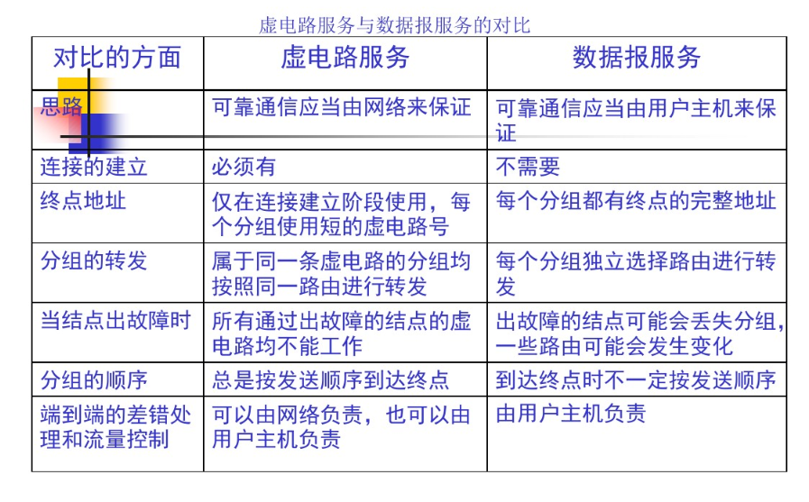

# 网络层
## 涉及到的硬件
## 涉及到的软件
## 开篇的重点
+ 虚拟互联网络的概念
+ IP地址与物理地址的关系
+ 传统的分类的IP地址(包括字码掩网) 和 无分类域间选择器选择 CIDR
+ 路由选择协议的工作原理

## 网络层提供的服务
网络层应该给运输层什么样的服务
面向连接 还是 无连接
可靠交付
### 网络设计思路
1. 网络层只是尽力的交付数据 只传不更改
+ 网络层向上只提供简单灵活的 无连接 尽最大努力交付的数据报服务+ 
+ 网络在发送分组时不需要建立连接 每一个分组独立发送  与其前后分组无关
+ 网络层不提供服务质量的承诺 所传递数据可能出错 丢失 重复 也不保证分组传送的时限  只负责传送
2. 尽力交付好处
+ 传输网络不提供端到端的可靠传输服务 使网络中的路由器可以做的简单 与电信网的交换机相比 价格低廉
+ 如果主机中的进程间的通信需要是可靠的 由网络的主机中的运输层负责
3. 设计思路优点 网络造价大大降低 运行方式灵活 能适应多种应用
### 虚电路服务
+ 面向连接的通信方式
+ 建立虚电路 保证双方通信所需的一切资源
+ 如果再使用可靠传输的协议 就可以使所发送的分组无差错的按序到达终点
+ 虚电路是虚拟的逻辑连接 分组沿着这条逻辑连接按照存储转发方式传送 并不是真实的物理连接
+ 分组交换的虚连接与电路连接不同 只是类似 电路连接是真正的建立了一条线

+ 虚电路服务与数据报服务的区别
### 数据报服务

## 网际IP协议
TCP/IP体系中 两个最重要的协议之一
与ip协议配套使用的还有四个协议
+ 地址解析协议 ARP
+ 逆地址解析协议RARP
+ 网际控制报文协议 ICMP
+ 网际管理协议 IGMP
